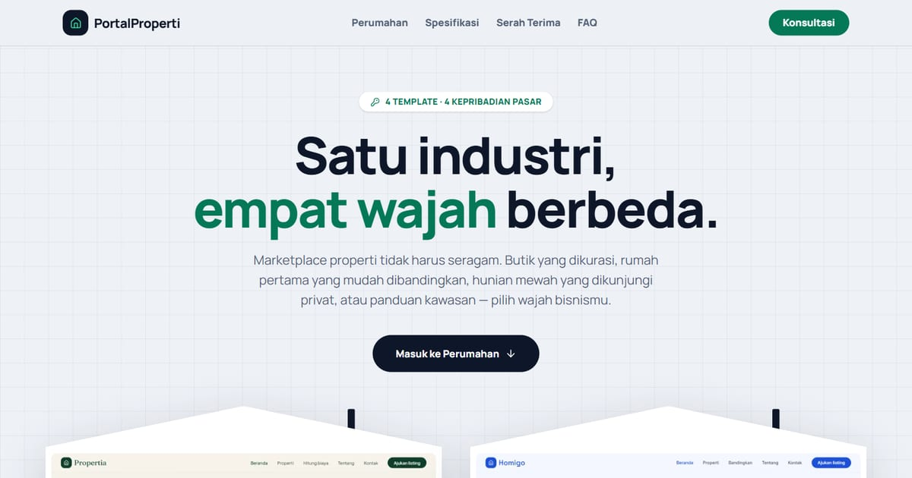

# PortalProperti — Empat Wajah Marketplace Properti

PortalProperti: 4 template marketplace properti dengan kepribadian berbeda — editorial, proptech, luxury, dan hangat.

**Demo live:** https://www.pintuweb.com/website-properti



> Katalog demo milik PintuWeb. Setiap kartu menautkan ke demo live yang bisa dicoba.

## Konsep

Katalog marketplace properti. Gaya cetak biru dengan kartu berbentuk rumah lengkap dengan atap dan cerobong.

## Varian yang dipamerkan (4)

- [Beranda](https://properti-beranda.vercel.app)
- [Homigo](https://properti-homigo.vercel.app)
- [Lumora](https://properti-lumora.vercel.app)
- [Propertia](https://properti-propertia.vercel.app)

## Halaman

`/`

## Teknologi

- Next.js 15.5 (App Router) dan React 19
- Tailwind CSS v4
- JavaScript
- Framer Motion, Lucide (ikon)
- Font: Manrope (next/font)
- SEO: metadata per halaman, Open Graph, JSON-LD, sitemap.xml, dan robots.txt

## Menjalankan secara lokal

```bash
npm install
npm run dev
```

Buka http://localhost:3000. Untuk build produksi: `npm run build` lalu `npm start`.

---

Dibuat oleh [PintuWeb](https://www.pintuweb.com), jasa pembuatan website.
